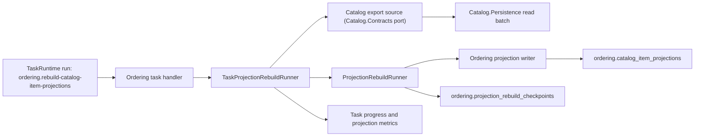

# Projection Rebuild Tasks

Projection rebuild tasks are the production mechanism for repairing or evolving derived read models after projection schema changes, missed events, data repair, or a new consumer module. They complement normal integration-event handling; they do not replace event-driven incremental updates.

## Implemented V1

The first implementation adds a small shared projection rebuild helper in `Shared.ProjectionRebuild`, an optional task adapter in `Shared.ProjectionRebuild.Tasks`, an optional EF adapter in `Shared.ProjectionRebuild.EntityFrameworkCore`, and a compiled Catalog-to-Ordering example:

- `ProjectionRebuildRunner<TSnapshot>` owns the generic task-neutral loop, checkpoint load/save, observer callbacks, and bounded metrics.
- `TaskProjectionRebuildRunner<TSnapshot>` in `Shared.ProjectionRebuild.Tasks` adapts the generic loop to task progress reporting and cooperative task control polling.
- `IProjectionRebuildSource<TSnapshot>` reads authoritative source batches through an explicit contract.
- `IProjectionRebuildWriter<TSnapshot>` writes or dry-runs idempotent consumer-owned projection batches.
- `IProjectionRebuildCheckpointStore` is resolved by consumer module and persists checkpoints in that module's schema.
- `ProjectionRebuildCheckpointState` and `EfProjectionRebuildCheckpointStore<TDbContext,TState>` remove repeated EF checkpoint boilerplate while preserving module-owned tables and migrations.
- `IProjectionRebuildTransactionBoundary` is optional and module-qualified; EF-backed modules can register `EfProjectionRebuildTransactionBoundary<TDbContext>` when writer effects and checkpoint saves share the same module DbContext.
- `Catalog.Contracts/Exports` exposes `CatalogItemProjectionExport` and `ICatalogItemProjectionExportSource`.
- `Catalog.Persistence` implements the export source from Catalog's EF model.
- `Ordering.Application` registers `rebuild-catalog-item-projections` as an explicit tenant-scoped task.
- `Ordering.Persistence` owns `ordering.projection_rebuild_checkpoints` and the writer for `CatalogItemProjection`.

The concrete use case is `Ordering` rebuilding its local `CatalogItemProjection` from Catalog exports after a consumer is introduced, a projection changes shape, or a repair/backfill is required.

## Problem

Event-driven projections handle future changes well. They are insufficient when existing projection rows need data that was not present in older events or older projection schema versions.

Examples:

- `Catalog` adds a new field that `Ordering` now needs in its catalog item projection.
- A consumer module is introduced after producer data already exists.
- A bug caused a projection handler to skip or corrupt some rows.
- An event subject or payload version changed and old rows must be migrated to the new read shape.
- A reporting projection must be rebuilt from authoritative source data.

Waiting for future update events is not enough, because many source rows may never change again.

## Core Idea

Keep normal projection updates event-driven, but add explicit rebuild tasks for existing data:

```text
Producer source data
  -> module-owned rebuild source
  -> batch snapshot stream
  -> consumer-owned projection writer
  -> progress, checkpoints, metrics, audit
```

The shared framework should own repetitive operational behavior:

- batching;
- checkpoints;
- cancellation;
- progress reporting through a small observer abstraction;
- retries;
- idempotent write orchestration;
- metrics and task progress payloads.

For EF-backed modules, `Shared.ProjectionRebuild.EntityFrameworkCore` owns the repeated checkpoint entity/store mapping shape. The module still provides a concrete checkpoint state type, maps it into its own schema, includes provider-specific migrations, and registers the store explicitly.
When a projection writer and checkpoint store use the same DbContext, the module may register an EF transaction boundary so each write batch and its checkpoint save commit or roll back together. Modules that write through separate stores or external systems should leave the boundary unregistered and keep the writer idempotent.

Tenant context remains owned by the caller. Tenant-scoped rebuild tasks declare tenant scope in `ModuleTaskDescriptor`; the worker sets `ITenantContextAccessor` before invoking the task handler, then the task handler calls `TaskProjectionRebuildRunner<TSnapshot>`.

The owning module must still define the data semantics:

- source contract;
- snapshot payload;
- destination projection;
- delete/tombstone behavior;
- version and compatibility rules.

## Design Principles

- Projection rebuilds are explicit module capabilities, not hidden runtime magic.
- A rebuild task writes only module-owned projection tables.
- A rebuild task must not write another module's source tables.
- Source modules expose data through contracts, export ports, event replay adapters, or read-only reporting adapters.
- The default production path must be resumable and idempotent.
- EF checkpoint helpers are optional adapter conveniences, not runtime discovery.
- Transaction boundaries are explicit module registrations, not global behavior.
- Reflection may reduce local registration boilerplate only when bounded to an explicitly supplied module assembly and guarded by metadata tests.
- Host composition remains explicit. No default host starts rebuild workers implicitly.

## Non-Goals

- Do not create cross-module foreign keys.
- Do not add synchronous per-row cross-module calls.
- Do not infer rebuild behavior from EF entity names or attributes.
- Do not make every projection rebuildable automatically.
- Do not require NATS for local or one-time rebuilds.
- Do not use projection rebuilds as a substitute for correct incremental event handlers.

## Current Flow



## Functional Requirements

### Task Declaration

Each rebuild task payload must declare split task attributes and be listed in module metadata with `ModuleDescriptor.Create(...).WithTask<TPayload>().Build()`.

The task payload should expose task identity constants and carry `TaskNameAttribute`, `TaskPayloadVersionAttribute`, `TaskDescriptionAttribute`, `TaskKindAttribute`, optional routing/control attributes, and `[TenantScoped]` when tenant context is required. The descriptor should reference it with `WithTask<TPayload>()`. The attributes must state:

- task name, for example `rebuild-catalog-item-projections`;
- task kind, normally `OneShot`;
- tenant scope;
- worker group, for example `projection-workers`;
- whether control messages are supported;
- payload version.

### Task Registration

Task handlers must be registered explicitly from the owning module application registration:

The preferred registration is the parameterless generic overload:

```csharp
services.AddTaskHandler<RebuildCatalogItemProjectionPayload, RebuildCatalogItemProjectionTask>();
```

A future constrained helper or source generator is acceptable only if it satisfies all of these conditions:

- it scans one explicitly supplied module application assembly;
- it registers only `ITaskHandler<TPayload>` implementations;
- it verifies task name, worker group, kind, tenant scope metadata, payload version, and control-message support against the payload attributes and `ModuleTaskDescriptor`;
- architecture tests fail on metadata or registration drift;
- hosts still explicitly compose the module and task worker runtime.

### Payload

The task payload must be stable and versioned.

V1 payload fields:

- projection version;
- batch size;
- dry-run flag;
- optional cursor override.

Recommended future fields:

- optional tenant id when tenant-scoped;
- optional force/full-rebuild flag;
- optional source filter, such as updated-after timestamp or id range;
- deduplication key.

Payloads must not contain secrets or raw connection strings.

### Source Adapter

The source adapter must be module-owned or contract-based.

Allowed source shapes:

- producer-owned export contract, such as paged `CatalogItemProjectionExport`;
- read-only source adapter composed in the rebuild host;
- event replay adapter over durable event storage if available;
- reporting/warehouse source for report-only projections;
- same-database read-only SQL adapter when explicitly documented as a reporting/backfill exception.

Disallowed source shapes:

- consumer module directly referencing producer EF entities;
- consumer module directly referencing producer repositories or application handlers;
- one request per source row over the event bus;
- writes to producer tables.

### Destination Writer

The destination writer must be consumer-owned and idempotent.

Requirements:

- upsert by stable natural key, usually `(TenantId, ExternalId)`;
- update only projection fields owned by the consumer;
- validate incoming snapshot values before persistence;
- handle unknown enum/status values explicitly;
- support tombstones or deletion policy when the source no longer exists;
- use bounded batch sizes;
- avoid loading the whole projection into memory.

### Checkpointing

Long-running rebuilds must checkpoint progress.

Minimum checkpoint data:

- source cursor or last processed key;
- processed count;
- written count;
- skipped count;
- failed count;
- current projection version;
- timestamp of last progress update.

The checkpoint must allow safe retry after worker crash, timeout, cancellation, or deployment restart.

### Concurrency

Rebuild tasks must define their interaction with live event handlers.

Supported strategies:

- event handlers and rebuild writer both perform idempotent upserts;
- rebuild uses source snapshots with last-modified ordering;
- rebuild records a high-water mark and then catches up from events after that mark;
- rebuild temporarily pauses only the affected projection handler when the operational cost is justified.

The first implementation should prefer idempotent upserts and avoid pausing live handlers.

### Tenant Handling

Tenant-scoped rebuilds must:

- require tenant id unless the task is explicitly global;
- set `ITenantContextAccessor` before source reads and projection writes;
- keep checkpoints tenant-scoped;
- prevent one tenant's rebuild from touching another tenant's projection rows;
- support per-tenant scheduling for large multi-tenant systems.

Global rebuilds must document why tenant context is not required.

### Versioning

Projection rebuild tasks must support versioned payloads and versioned projection contracts.

When a producer adds an optional field:

- prefer additive event/export contract changes;
- add nullable or defaulted projection columns first;
- backfill existing rows;
- make the field required only after backfill is complete and verified.

When a producer makes a breaking change:

- publish a new event/export version;
- register a new rebuild payload version;
- keep old handlers until old in-flight messages and task runs are drained;
- document rollback behavior.

## Non-Functional Requirements

### Reliability

- Rebuild tasks must be retryable.
- Writes must be idempotent.
- A partially completed rebuild must be resumable.
- Cancellation must leave the projection in a valid, retryable state.
- Failures must surface as task-run failures with stable error codes where possible.

### Performance

- Rebuilds must use batched reads and writes.
- Batch size must be configurable.
- The source adapter must support paging or cursors.
- The task must avoid N+1 module calls.
- The task must not block normal request paths.
- Large rebuilds should run on dedicated worker groups.

### Observability

Each rebuild must emit:

- task run id;
- module name;
- task name;
- projection name;
- tenant id when present;
- source cursor/checkpoint;
- processed/written/skipped/failed counts;
- elapsed time;
- batch duration;
- retry count;
- terminal status.

Metrics should include:

- active rebuild count;
- queued rebuild count;
- rows processed;
- rows written;
- rows skipped;
- rows failed;
- batch duration;
- task duration;
- failure count by reason.

### Security and Administration

Operator-triggered rebuilds must require explicit admin permission.

Recommended permission:

```text
<module>.projections.rebuild
```

Admin CLI/API operations should support:

- enqueue rebuild;
- inspect status;
- cancel;
- retry;
- list recent runs;
- show last checkpoint;
- dry run when supported.

Admin audit records should include task name, projection name, tenant id, requestor, payload version, and result. They must not include secrets or large payload data.

### Deployment

Projection schema changes should use a staged rollout:

1. Add new nullable/defaulted projection columns.
2. Deploy code that writes the new field for future events.
3. Enqueue rebuild/backfill.
4. Verify projection completeness.
5. Tighten constraints or enable new read behavior.

Rollback must be documented for each projection change.

## Suggested Shared Abstractions

The shared layer may provide generic orchestration contracts:

```csharp
public interface IProjectionRebuildSource<TSnapshot>
{
    Task<ProjectionReadBatch<TSnapshot>> ReadAsync(
        ProjectionRebuildCheckpoint? checkpoint,
        int batchSize,
        CancellationToken cancellationToken);
}

public interface IProjectionRebuildWriter<TSnapshot>
{
    Task<ProjectionWriteResult> WriteAsync(
        IReadOnlyCollection<TSnapshot> snapshots,
        CancellationToken cancellationToken);
}
```

The shared task base may handle:

- loop control;
- checkpoint persistence;
- progress reporting;
- cancellation;
- metrics;
- structured logs.

The module must implement:

- snapshot type;
- source adapter;
- writer adapter;
- validation rules;
- task payload;
- task registration;
- module metadata.

## Testing Requirements

Unit tests:

- payload validation;
- source cursor handling;
- writer idempotency;
- tombstone behavior;
- enum/status compatibility;
- cancellation behavior.

Integration tests:

- rebuild from empty projection;
- rebuild after partial projection rows exist;
- resume after failure;
- live event update races with rebuild;
- tenant A rebuild does not affect tenant B;
- migration plus backfill scenario for a newly added field.

Architecture tests:

- task metadata matches registration;
- rebuild task handlers stay in owning module application projects;
- no producer internals are referenced by consumer modules;
- no hidden assembly-wide rebuild registration is introduced.

Operational tests:

- task progress and checkpoints are visible;
- retry and cancel flows work;
- large batch settings do not exhaust memory;
- metrics and logs include required dimensions.

## Acceptance Criteria

The feature is production-ready when:

- at least one real module projection can be rebuilt end to end;
- the rebuild is idempotent and resumable;
- tenant isolation is proven;
- the task can be enqueued, inspected, canceled, and retried through admin surfaces or a documented operator path;
- metrics, logs, progress, and audit records identify the projection and run;
- architecture tests prevent hidden module scanning and cross-module internals;
- docs explain how to add a new rebuild task for a module projection.

## Implementation Slices

1. Document the projection rebuild pattern and add backlog item.
2. Add shared projection rebuild contracts and task orchestration helpers.
3. Add admin/operator enqueue and inspect flow for task runtime if missing.
4. Implement `Ordering` catalog projection rebuild as the first concrete module task.
5. Add migration/backfill documentation using the concrete task.
6. Add architecture guards for rebuild task registration and source boundary rules.
7. Add production metrics and runbook guidance.

