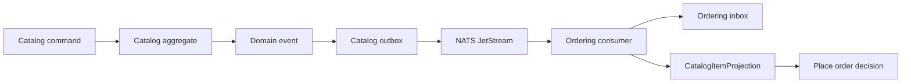
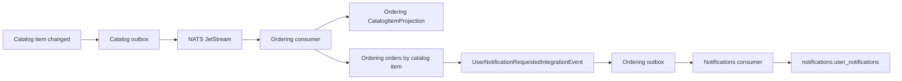
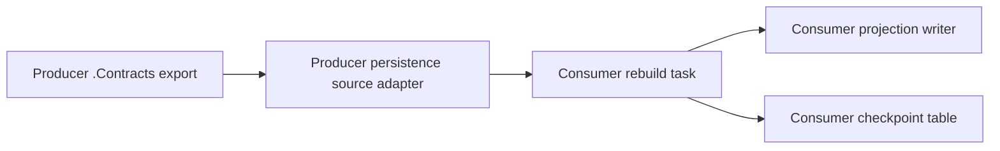

# Cross-Module Integration

The default pattern is asynchronous integration through contracts and local projections.

## Rule

Modules may reference another module's `.Contracts` project only.

Allowed:

```text
Ordering.Application -> Catalog.Contracts
```

Not allowed:

```text
Ordering.Application -> Catalog.Application
Ordering.Persistence -> Catalog.Persistence
Ordering.Domain -> Catalog.Domain
OrderingDbContext -> FK to catalog.items
```

Public contract surfaces should still belong to the module that publishes them. A consumer module can reference a producer's contracts for integration event payloads, subject constants, subscription metadata, and projection export contracts, but it should not expose producer DTOs or enums from its own `.Contracts` or `.Admin.Contracts` API. Duplicate the scalar/read-model fields that the consumer owns instead.

Projection rebuilds follow the same rule. A producer can expose an export contract from its `.Contracts` project, and the producer's persistence adapter can implement that source. The consumer still owns the destination table, checkpoint table, and rebuild task.

## Why Duplicate Data?

Duplicated read data keeps modules independently understandable and replaceable. A consumer stores the data it needs for local decisions and updates that data from integration events.

This is not "stale cache" data. It is module-owned state with eventual-consistency semantics.

## Flow



## Addressed Notifications From Local Decisions

Notification delivery follows the same ownership rule. The module that understands the resource decides recipients; the Notifications module only stores and streams already-addressed notification requests.

The Catalog/Ordering example uses:



This is the same shape a private chat or PMS policy module should use:

- chat membership and message visibility belong to the chat module;
- property/user-management policies belong to the PMS module;
- catalog regional availability belongs to Catalog or the module that owns regional market rules;
- Notifications receives explicit user targets only, never business-specific visibility rules.

## Compatibility

Producer events should change additively. Breaking payload changes require a new event version and subject.

Consumers should ignore fields they do not need. They should be prepared for duplicate delivery.

Consumer registrations should use producer subject constants and consumer handler-name constants from module metadata. Avoid copying raw subject or durable-handler strings into application registration.

## Backfill and Repair

When existing local projection data must be repaired, prefer an explicit rebuild task:



The consumer may duplicate producer data deliberately. It must not add a cross-module foreign key or reference producer EF/domain/application projects to make the rebuild easier.
