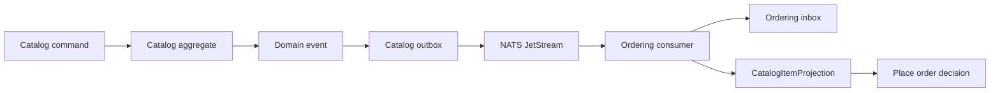

# Cross-Module Integration

The default pattern is asynchronous integration through contracts and local projections.

## Rule

Modules may reference another module's `.Contracts` project only.

Allowed:

```text
Ordering.Application -> Catalog.Contracts
```

Not allowed:

```text
Ordering.Application -> Catalog.Application
Ordering.Persistence -> Catalog.Persistence
Ordering.Domain -> Catalog.Domain
OrderingDbContext -> FK to catalog.items
```

Public contract surfaces should still belong to the module that publishes them. A consumer module can reference a producer's contracts for integration event payloads, subject constants, and subscription metadata, but it should not expose producer DTOs or enums from its own `.Contracts` or `.Admin.Contracts` API. Duplicate the scalar/read-model fields that the consumer owns instead.

## Why Duplicate Data?

Duplicated read data keeps modules independently understandable and replaceable. A consumer stores the data it needs for local decisions and updates that data from integration events.

This is not "stale cache" data. It is module-owned state with eventual-consistency semantics.

## Flow



## Compatibility

Producer events should change additively. Breaking payload changes require a new event version and subject.

Consumers should ignore fields they do not need. They should be prepared for duplicate delivery.

Consumer registrations should use producer subject constants and consumer handler-name constants from module metadata. Avoid copying raw subject or durable-handler strings into application registration.
